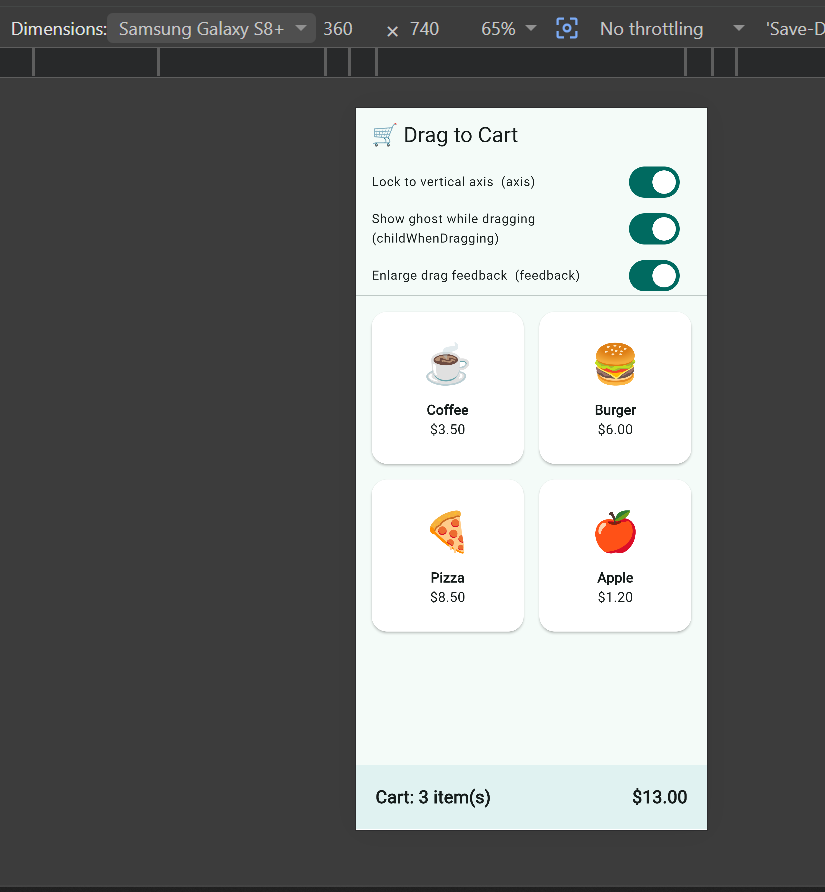

# Drag to Cart — Flutter `Draggable` Demo

<!-- 👉 Replace everything in [brackets] with YOUR OWN words. Then delete every line marked with 👉 and this top comment. -->

## What this widget does
[Write ONE sentence describing what the Draggable widget lets the user do.]
<!-- 👉 Keep it to a single line — this is the "one-line widget description" the rubric asks for. -->

## How to run
```bash
flutter create drag_to_cart
# then replace lib/main.dart with the main.dart in this repo
flutter run
```
<!-- 👉 Add one line saying it also runs in Chrome/emulator/real device if you want. -->

## The three Draggable attributes I demonstrated
- **feedback** — [one sentence: what it is, and what changed on screen when you toggled it]
- **childWhenDragging** — [one sentence: mention the default is `null`, and what your faded "ghost" showed]
- **axis** — [one sentence: default `null` = drag any direction; `Axis.vertical` = up/down only]
<!-- 👉 Write each in your own words. Don't copy my earlier explanation word-for-word. -->

## Screenshot

